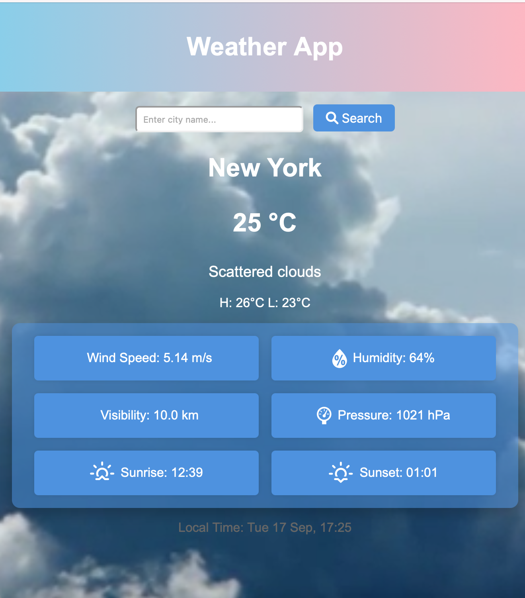

# Weather App

## Description
This Weather App allows users to retrieve weather information for any city around the world. The app displays current weather data, such as temperature, humidity, wind speed, visibility, and local time, while dynamically changing the background based on the weather condition.

## Features
- Search weather by city name.
- Displays current temperature, humidity, wind speed, pressure, visibility, and more.
- Shows local time based on the city’s timezone.
- Dynamic background video or image changes based on weather conditions (e.g., clear, rain, snow).
  
## Technologies Used
- **HTML**: Structure of the app.
- **CSS**: Styling and layout.
- **JavaScript**: Logic for fetching and displaying weather data.
- **OpenWeatherMap API**: Used for retrieving real-time weather information.

## How to Run

### Prerequisites
- Modern web browser (Chrome, Firefox, Edge, etc.).
- A valid OpenWeatherMap API key.

## API Demo

This screenshot demonstrates the app fetching weather data using the OpenWeatherMap API.

